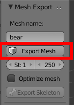
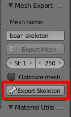
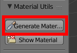

# Worldforge Media Pipeline

[](https://gitter.im/Worldforge/Lobby)

These are addons to Blender and Maya which allows for easy export of assets into formats used by Worldforge.

## Blender addon

See [installation instructions](./blender/INSTALL.md) on how to install the Blender addon. 

### Usage instructions

The Blender plugin makes it easy to export meshes and skeletons/animation rigs from Blender into the Ogre format which Worldforge uses.
Apart from converting it to the correct format it also takes care of making sure that materials are correctly named, and 
that skeletons are linked.

In order for automatic naming of materials and paths to work the assets you work with must both follow the [Worldforge 
Assets naming system](https://svn.worldforge.org:886/svn/media/trunk/assets/README.ASSETS.md), as well as being placed 
in a directory under the [Worldforge Media repository's "assets" directory](https://svn.worldforge.org:886/svn/media/trunk/assets).

Per the naming conventions, the .blend file _must_ be placed under a directory named ```source```. Exported meshes and
skeletons will then be placed in a ```model``` directory alongside the ```source``` directory.

#### Mesh export



To export a mesh, first select it. This will enable the ```Export Mesh``` button. This will generate an OGRE .mesh file, 
using the same name as the Blender mesh. 

Any skeletons used by the mesh will also be referred to relative the ```assets``` directory.

If multiple meshes are selected, they will be combined into one single OGRE mesh. The active object will be used both 
for name and for center point. Note this this only works for meshes without armatures.

##### Material naming

When exporting a mesh the addon will generate suitable material names for the OGRE mesh. This is done by looking at the
textures used by each material. If a diffuse texture named "D.png" is used by the material, the path of this texture 
relative to the ```assets``` root directory is will be used to determine the material name.

This of course relies on the textures being placed under the Worldforge Media Repository root.

However, if the Blender material name starts with a "/" the material name will be used directly. This allows you to 
specify custom materials.

#### Skeleton export



If an armature is selected the ```Export Skeleton``` button will be activated. Note that this only works for armatures 
that aren't linked in from an external library.

All animations that are attached to an NLA track will be exported alongside the armature.

The resulting .skeleton file will be placed in the ```model``` directory alongside the ```source``` directory.

#### Material generation



The ```Generate Material``` button will go through all materials used by the mesh and check if there's a corresponding 
```ogre.material``` file. If not, one will be used. This happens through the use of the ```material.py``` code contained in
the Worldforge Media Repository, so this feature will only work if the .blend file is placed within the repository.
 


